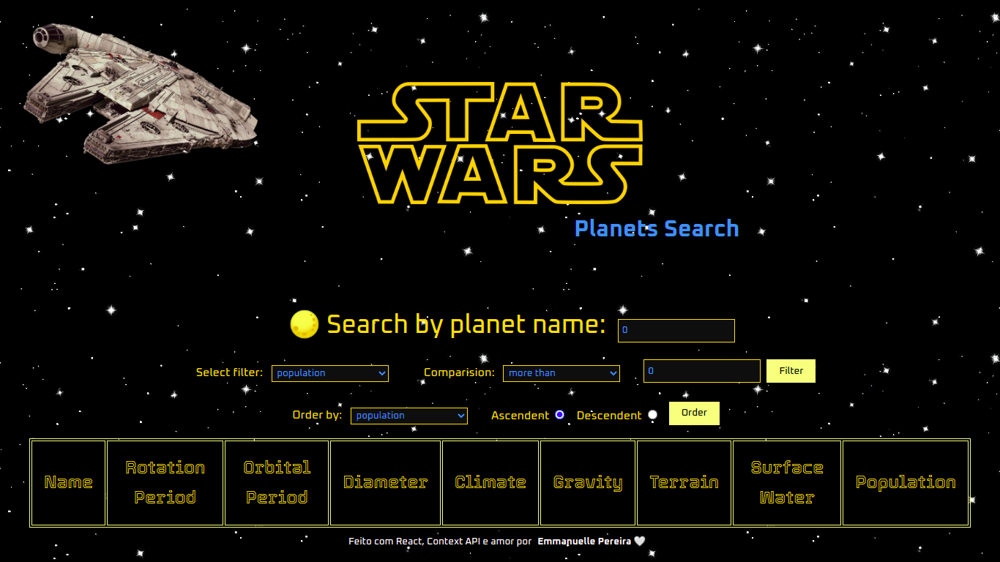

# Star Wars Planets Search


# Contexto
Este projeto foi desenvolvido enquanto aluna na [Trybe](https://www.betrybe.com/), com o objetivo de criar uma aplicação que consulta uma API para recuperar dados dos planetas do universo de Star Wars, podendo filtrar por suas características como população, período orbital, diâmetro entre outras.
> Obs.: Nesta versão, alguns filtros como Filmes, Criação e Edição foram omitidos. A versão completa do componente `Table.jsx` está em `src/components/tableComplete.txt`.


---
### Objetivos
Desenvolver uma aplicação de pesquisa usando um endpoint da [API](https://swapi-trybe.herokuapp.com/api/planets/)para obter as informações sobre os planetas. O resultado deve ser disposto em uma tabela e filtrados usando **Context API e Hooks** para controlar os estados globais.

As habilidades exercitadas neste projeto foram:

* Utilizar a _Context API_ do **React** para gerenciar estado.
* Utilizar o _React Hook useState_;
* Utilizar o _React Hook useContext_;
* Utilizar o _React Hook useEffect_;
* Criar _React Hooks_ customizados.


## Tecnologias usadas

Front-end:
* React
* Context API
* React Hooks
* HTML/CSS
* Pacotes NPM


## Capturas de telas

#### Tela Inicial

---


#### Tabela Completa

---


#### Filtrando a pesquisa


---
## Instalando dependências

* No diretório raiz do projeto:
```
npm install
```

## Iniciando aplicação

* Rodando localmente:
```
npm start
```

## Executando testes

* Para rodar todos os testes:
```
npm test
```

Obs.: os testes já vieram implementados pela equipe da Trybe.
